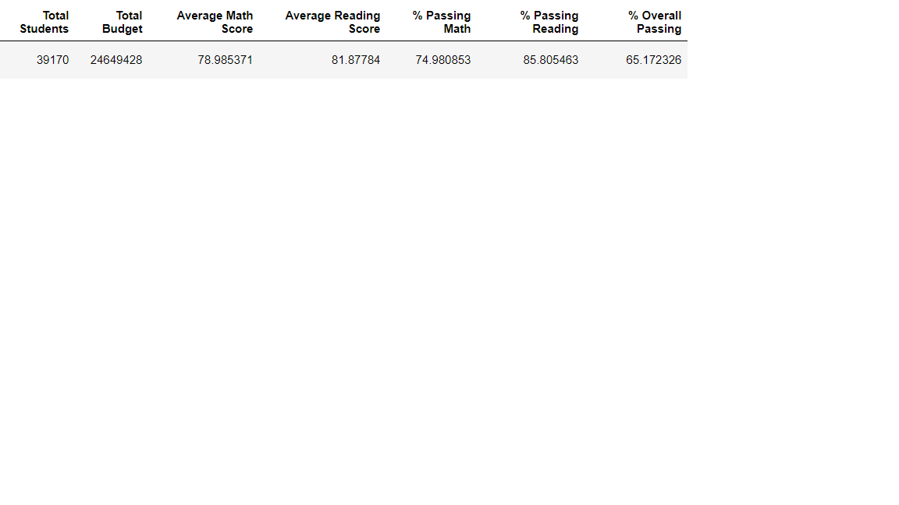
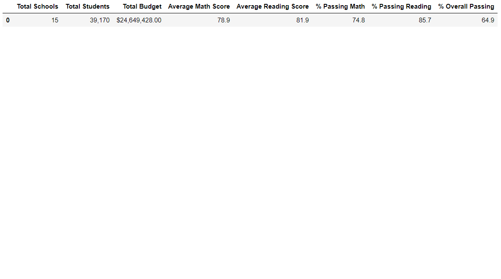

# School_District_Analysis

## Overview of the school district analysis

The purpose of this analysis is to help the school board determine if there is evidence of academic dishonesty. Specifically, reading and math grades for Thomas High School ninth graders appear to have been altered. So we were asked to replace the math and reading scores for Thomas High School with NaNs while keeping the rest of the data intact. Once we replaced the math and reading scores we will repeat our analysis and write up a report to describe how these changes affected the overall analysis.

## Results

Using bulleted lists and images of DataFrames as support, address the following questions.

### How is the district summary affected?

The new district overall percent who passed decreased from 65.2% in the original analysis to 64.9% in the updated analysis. 
The percent who passed reading decreased from 85.8% in the original analysis to 85.7% in the updated analysis. 

The percent who passed math decreased from 75.0% in the original analysis to 74.8% in the updated analysis.

### How is the school summary affected?

When looking at the school summary dataframe Thomas High School's data was changed when removing the 9th grade data. 
The new Thomas High School overall percent who passed decreased from 90.9% in the original analysis to 90.6% in the updated analysis. 
The percent who passed reading decreased from 97.3% in the original analysis to 97.0% in the updated analysis. 
The percent who passed math decreased from 93.3% in the original analysis to 93.2% in the updated analysis.

### How does replacing the ninth graders’ math and reading scores affect Thomas High School’s performance relative to the other schools?

Overall, Thomas still has the second highest overall % of students who passed. However they go from the school with the highest number of students % passing reading to second highest.

## Summary

### How does replacing the ninth-grade scores affect the following:

Math and reading scores by grade - The only thing that changes is for Thomas High school row and 9th grade column has a "nan" value.

Scores by school spending - The only change to the data would be to the grouping of $630-$644 summary. The grades decrease from an average math score of 79.1 and an average reading score of 81.9 to 78.5 average math score and 81.6 reading score. Subsequently the percent who pass Math, Reading and Overall was 73%, 84%, and 63% respectively in the original data. But with 9th graders removed from Thomas High School he percent who pass Math, Reading and Overall was 76%, 86%, 66%. 

Scores by school size - Now that it is only 3 categories the impact of removing 9th graders data from Thomas High School. So the overall school size summary that looks at the Average Math Score,	Average Reading Score,	% Passing Math,	% Passing Reading, and	% Overall Passing appear to be unchanged at 83.4, 83.9, 94%, 97%, and 91% respectively. Though in reality each category decreased by a few hundredths of a percent.

Scores by school type - Similar to the school size data the overall summary the overall school type summary that looks at the Average Math Score,	Average Reading Score,	% Passing Math,	% Passing Reading, and	% Overall Passing appear to be unchanged at 83.5, 83.9, 94%, 97%, and 90% respectively. Though in reality each category decreased by a few hundredths of a percent.
